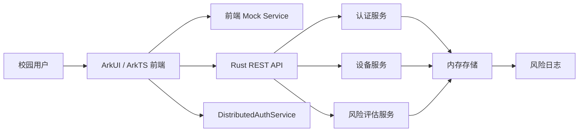

# 系统设计说明

## 设计目标

本项目面向智慧校园场景，目标是在 OpenHarmony 设备上实现“无感、可信、可追溯”的身份认证体验。系统通过手机、平板等设备模拟分布式协同认证，并使用 Rust 后端统一管理用户、设备、认证记录和风险评分。

## 总体架构

## 前端分层

- `pages/`：页面入口，包含登录、首页、无感认证、记录、设备管理和管理员页面。
- `components/`：复用 UI 组件，如统计卡片、状态标签、章节标题。
- `models/`：用户、设备、认证记录和风险评分数据模型。
- `services/`：认证、设备、分布式协同、风险评分和 API 访问服务。
- `utils/`：常量、时间格式化等工具函数。

## 后端分层

- `routes/`：REST API 路由处理。
- `models/`：请求、响应和业务实体。
- `services/`：登录校验、认证记录、设备绑定、风险评分逻辑。
- `storage/`：内存存储，包含用户、设备、认证记录、风险日志，后续可替换为数据库。
- `ApiResponse<T>`：所有 REST API 的统一返回格式，包含 `success`、`code`、`message`、`data`。

## 无感认证流程

1. 用户在无感认证页选择认证方式：二维码、可信设备或蓝牙/近场。
2. 前端通过 `DistributedAuthService` 模拟设备发现和跨设备结果同步。
3. `AuthService` 生成认证结果，并调用 `RiskService` 计算风险等级、风险原因和处理建议。
4. 认证记录写入前端 mock 数据和后端内存数据，后端同步写入风险日志。
5. 首页、记录页和管理员页展示最新结果。

## 分布式协同设计

当前项目使用 mock 层模拟设备协同：

- 手机作为发起端，创建认证请求。
- 平板或穿戴设备作为展示端，接收认证结果。
- 接口命名保留 `discoverNearbyDevices`、`publishAuthResult`、`syncAuthState` 等真实能力替换点。
- `DistributedDeviceService`：预留 OpenHarmony 设备发现、软总线通道、手机/平板布局识别接口。
- `RemoteAuthService`：预留跨设备远程认证会话接口，当前调用本地 mock 认证。
- `DeviceTrustManager`：提供设备可信度评分，综合可信标记、在线状态、OpenHarmony 设备环境和分布式角色。

后续可替换为 OpenHarmony 分布式软总线、分布式数据管理或设备管理能力。

## 设备可信度模型

设备可信度不再只依赖 `trusted` 布尔值，而是使用 `DeviceTrustProfile` 描述：

- `score`：0 到 100 的可信评分。
- `level`：低可信、中可信、高可信。
- `hardwareAttestation`：预留硬件可信校验结果。
- `localCredential`：本机凭据或用户绑定状态。
- `proximityStable`：近场信号稳定性。
- `distributedRole`：认证发起端、认证复核端或结果展示端。

当前评分由规则模拟，后续可接入 OpenHarmony 真实设备可信认证、密钥证明、设备管理和近场发现能力。

## 手机和平板布局

项目面向至少两类设备：

- 手机：作为认证发起端，采用单栏、快速操作优先的布局思路。
- 平板：作为结果展示端，采用双栏看板和列表布局，适合比赛答辩展示。

前端通过 `ResponsiveLayoutUtil`、`AppLayout.pageMaxWidth` 和页面网格布局控制宽屏展示密度，同时在分布式协同状态中标记 `phone` / `tablet` 布局模式。

## AI 风险评估设计

当前使用规则引擎模拟 AI 风险评分：

- 夜间认证增加风险。
- 陌生设备或设备可信度不足增加风险。
- 实验室、机房等敏感地点增加风险。
- 连续失败次数增加风险。
- 蓝牙/近场或非可信设备二维码认证增加风险。
- 短时间多地认证会触发异常行为检测。

输出字段：

- `riskScore` / `risk_score`：0 到 100 风险分。
- `riskLevel` / `risk_level`：低风险、中风险、高风险。
- `riskReason` / `risk_reason`：风险原因说明。
- `suggestion`：处理建议。
- `abnormalTypes` / `abnormal_types`：异常行为标签。

代码中前端预留 `AiRiskModel` 接口，后端预留 `MlRiskModel` trait。当前 `PlaceholderMlRiskModel` 返回空结果并回退到规则引擎，后续可接入端侧模型、云端模型或混合推理。
